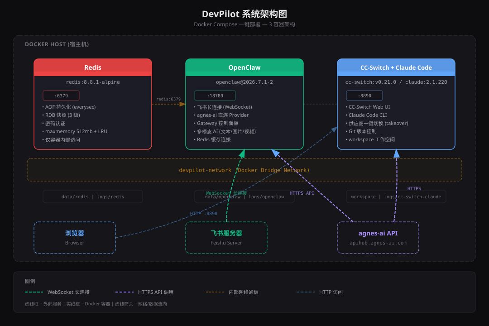

# DevPilot

Docker Compose 一键部署 AI 自动开发平台：飞书 AI 机器人 + Claude Code 编程助手 + Redis 缓存 + 服务自动部署。全部组件在 Docker 容器内运行，不依赖宿主机环境。Claude Code 开发的服务可自动构建并部署到 Docker / Kubernetes / 远程服务器。

## 快速开始

```bash
git clone <repo-url> devpilot && cd devpilot
./init.sh && ./deploy.sh
```

`init.sh` 配置向导只需填写 **3 个必填项**，其余密码自动生成：

- API Key（agnes-ai）
- 飞书 App ID
- 飞书 App Secret

部署完成后：

- 飞书机器人：在飞书中搜索添加机器人，发消息即可获得 AI 回复
- Claude Code：`docker compose exec cc-switch-claude claude`
- CC-Switch Web UI：浏览器打开 `http://localhost:8890`
- OpenClaw Gateway：`http://localhost:18789/healthz`

## 架构



| 容器 | 镜像 | 端口 | 职责 |
|------|------|------|------|
| Redis | `redis:8.8.1-alpine` | 6379（内部） | 缓存 + AOF/RDB 持久化 |
| OpenClaw | `node:22.23.1` + `openclaw@2026.7.1-2` | 18789 | 飞书 AI 机器人（WebSocket 长连接）+ agnes-ai 对接 |
| CC-Switch + Claude Code | `node:22.23.1` + `cc-switch@v0.21.0` + `claude-code@2.1.220` | 8890 | 供应商配置管理 + 编程助手 + Git |

> 组件版本统一在 [`versions.env`](versions.env) 中管理，这是版本号的单一配置源。修改版本只需编辑该文件，本地脚本与 Dockerfile 会自动加载，无需多处同步。

## 部署模式

```bash
docker compose up -d --build            # 全部启动（默认）
docker compose --profile bot up -d     # 仅飞书机器人（Redis + OpenClaw）
docker compose --profile dev up -d     # 仅开发环境（CC-Switch + Claude Code）
```

### Kubernetes 部署（Helm）

K8s 部署采用 **Helm Chart 唯一方式**，不再提供 kubectl 原生清单。统一脚本会自动从 `.env` 生成 values 并部署：

```bash
bash cicd/scripts/deploy.sh --mode k8s --helm
```

## 常用命令

```bash
make init        # 配置向导
make up          # 构建并启动
make up-bot      # 仅启动飞书机器人
make up-dev      # 仅启动开发环境
make down        # 停止服务
make logs        # 查看日志
make health      # 健康检查
make claude      # 启动 Claude Code
make help        # 查看所有命令
```

## 服务自动部署

Claude Code 在 `workspace/` 下开发的服务可自动构建并部署到 Docker / K8s / 远程服务器。在 `.env` 中开启：

```bash
DEVPILOT_AUTO_DEPLOY=true
```

开启后，开发完成钩子（`post-dev-hook.sh`）会自动检测 `workspace/` 下有变更的服务并部署。也可通过飞书 `/deploy` 命令或手动执行 `deploy-service.sh` 触发。详见 [服务自动部署文档](cicd/service-deploy/README.md)。

## 目录结构

```
devpilot/
├── docker-compose.yml          # 主编排文件
├── Makefile                    # 快捷命令
├── init.sh                     # 配置向导（3 个必填项，密码自动生成）
├── deploy.sh                   # 一键部署脚本
├── versions.env                # 组件版本单一配置源
├── .env / .env.example         # 环境变量
├── .dockerignore               # Docker 构建优化
├── images/                     # 架构图
├── conf/                       # 配置文件
│   ├── redis/redis.conf
│   ├── openclaw/
│   └── cc-switch-claude/
├── dockerfiles/                # Dockerfile
├── cicd/                       # CI/CD 配置
│   ├── lib/common.sh           # 公共函数库（颜色/日志/校验/健康检查）
│   ├── ci/                     # 平台 CI（GitHub / Gitee / GitLab）
│   │   └── scripts/lint.sh     # 统一 CI Lint 检查脚本
│   ├── cd/                     # 平台 CD（Docker / K8s Helm）
│   └── service-deploy/         # 服务自动部署（开发完成 -> 自动构建部署）
└── workspace/                  # Claude Code 工作目录（开发的服务存放于此）
```

## 文档

- [用户手册](user-manual/user-manual.html) — 原理、架构、部署、运维、使用、案例
- [CI/CD 文档](cicd/README.md) — 持续集成与持续部署配置（含公共函数库、版本管理、CI Lint）
- [服务自动部署](cicd/service-deploy/README.md) — Claude Code 开发的服务自动构建部署
- [优化分析](OPTIMIZATION.md) — 架构深度分析与优化建议
- [环境变量模板](.env.example) — 配置项说明
- [版本配置](versions.env) — 组件版本单一配置源
