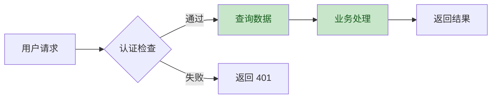
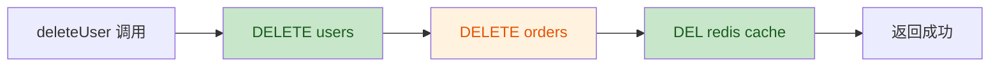

# 技能：代码审查（Review）

<!--
  ============================================================
  技能名称：代码审查
  技能角色：代码审查员 / 质量工程师
  触发条件：开发执行（Dev）所有任务完成后自动触发
  输入：完整项目代码 + PRD 验收标准 + 开发计划
  输出：代码审查报告 + 通过/不通过决策
  门控：无（自动化审查，通过则进入 Test 阶段，不通过则返回 Dev 修复）
  优先使用：alibaba/open-code-review（独立 CLI 工具，行级精准定位）
  备选方案：TRAE-code-review（Trae IDE 内置技能，Prompt 驱动）
  ============================================================
-->

## 一、技能概述

代码审查阶段对开发完成的项目代码进行全面审查，确保代码质量在进入测试阶段前达到标准。本技能优先使用 [`alibaba/open-code-review`](https://github.com/alibaba/open-code-review)（独立 CLI 工具，确定性工程 × Agent 混合架构，行级精准定位），当该工具不可用时回退到 Trae IDE 内置的 `TRAE-code-review` 技能（Prompt 驱动）。两者覆盖相同的五个审查维度：正确性、安全性、性能、可维护性和最佳实践。

**工具对比：**

| 对比项 | alibaba/open-code-review（优先） | TRAE-code-review（备选） |
|--------|--------------------------------|------------------------|
| 类型 | 独立 CLI 工具（`ocr` 命令） | Trae IDE 内置技能 |
| 架构 | 确定性工程 × Agent 混合 | 纯 Prompt 驱动 |
| 精度 | 行级精准，低误报 | 依赖 LLM 推理 |
| Token | ~1/9 消耗（高效） | 标准 Token 消耗 |
| 安装 | `npm i -g @anthropic-ai/open-code-review` | 无需安装 |

**安装 alibaba/open-code-review（推荐）：**

```bash
# npm 全局安装
npm install -g @anthropic-ai/open-code-review

# 或 Homebrew（macOS/Linux）
brew install alibaba/tap/open-code-review

# 验证安装
ocr --version

# 配置 LLM 端点（支持 OpenAI 兼容接口）
export OCR_LLM_URL=https://api.example.com/v1/chat/completions
export OCR_LLM_TOKEN=your-api-key
export OCR_LLM_MODEL=your-model-name
```

**核心原则：**
- 自动化优先：能自动检测的问题不靠人工发现
- 证据驱动：每个问题都有明确的代码位置和修复建议
- 零误报：通过交叉验证减少虚假告警
- 闭环修复：发现问题 -> 修复 -> 重新审查，直到通过

## 二、审查流程

```
开发完成 -> 自审查 -> 自动化分析 -> AI 代码审查 -> 结果判定
   |          |          |              |            |
   v          v          v              v            v
 触发审查   开发者自检   Lint/安全扫描   ocr review / TRAE  通过/不通过
                                                      |
                                           +----------+----------+
                                           |                     |
                                         通过                  不通过
                                           |                     |
                                           v                     v
                                     进入测试              返回开发修复
```

## 三、执行步骤

### 步骤 1：开发者自审查

AI 开发者首先进行自审查，逐项检查：

```markdown
## 自审查清单

### 功能完整性
- [ ] 所有 PLAN.md 中的任务已完成
- [ ] PRD 中标注 P0 的功能全部实现
- [ ] 无遗漏的异常处理分支

### 代码规范
- [ ] 命名符合项目规范（kebab-case / camelCase / PascalCase）
- [ ] 每个函数不超过 50 行，每个文件不超过 300 行
- [ ] 关键逻辑有中文注释（解释「为什么」而非「做什么」）
- [ ] 无调试代码残留（console.log / print / debugger）

### 安全检查
- [ ] 无硬编码的密钥、密码、Token
- [ ] 所有用户输入有服务端校验
- [ ] SQL 查询使用参数化查询或 ORM
- [ ] 密码使用 bcrypt / argon2 哈希存储
- [ ] CORS 配置未使用 `*` 通配符（生产环境）

### 代码整洁
- [ ] 无未使用的 import / 变量 / 函数
- [ ] 无重复代码（DRY 原则）
- [ ] 无过深的嵌套（不超过 3 层）
- [ ] 无超长参数列表（超过 5 个参数考虑封装为对象）
```

自审查发现问题直接修复，不进入 AI 审查环节。

### 步骤 2：自动化代码分析

运行静态分析工具进行自动化检查：

```bash
# ---- 代码规范检查（Lint） ----
# Node.js
npx eslint src/ --ext .ts,.tsx --max-warnings 0
npx prettier --check src/

# Python
flake8 src/ --max-line-length=120
black --check src/
isort --check-only src/

# Go
gofmt -l .
golangci-lint run

# Rust
cargo clippy -- -D warnings

# Java
./mvnw checkstyle:check

# ---- 类型检查 ----
# TypeScript
npx tsc --noEmit

# Python（使用 mypy）
mypy src/ --ignore-missing-imports

# ---- 安全扫描 ----
# 依赖漏洞扫描
npm audit --audit-level=high          # Node.js
pip-audit -r requirements.txt          # Python
govulncheck ./...                      # Go
cargo audit                            # Rust

# 敏感信息泄露检查
gitleaks detect --source . --report-path leaks-report.json
```

**通过标准：** Lint 检查 0 errors，类型检查 0 errors，安全扫描无高危漏洞。

自动化分析失败则直接返回 Dev 阶段修复，不进入 AI 审查环节。

### 步骤 3：AI 代码审查

优先使用 `alibaba/open-code-review` CLI 工具，不可用时回退到 `TRAE-code-review` 技能，对代码变更进行智能审查。

**方式 1：使用 alibaba/open-code-review CLI（推荐）**

```bash
# 审查 Git diff（本次开发变更）
ocr review

# 审查整个目录（无 diff 时）
ocr scan src/

# 输出 JSON 格式报告
ocr review --format json -o review-report.json
```

**方式 2：使用 TRAE-code-review 技能（备选）**

在 Trae IDE 中调用 `TRAE-code-review` 技能，按照其内置流程（确定范围 -> 收集上下文 -> 推断意图 -> 生成概览 -> 扫描问题 -> 交叉验证 -> 输出结果）执行审查。

#### 3.1 确定审查范围

```bash
# 获取本次开发的全部代码变更
git diff main --stat                    # 变更文件概览
git diff main --name-only               # 变更文件列表
git log main..HEAD --oneline            # 提交历史
```

审查范围包括：
- 本次开发产生的所有代码变更（git diff）
- 新增文件的完整内容
- 配置文件变更（Dockerfile、CI/CD 配置等）

> 注意：跳过非代码文件（`.md`、`.json`、`.txt`、`.svg` 等纯文档/配置文件）。

#### 3.2 收集上下文

使用 `SearchCodebase`、`Read` 等工具获取相关源码和设计文档，确保审查基于完整上下文：
- 读取 PRD 文档中的验收标准和非功能需求
- 读取 PLAN.md 中的任务列表和技术选型
- 读取变更文件的完整内容（不仅是 diff）
- 查找变更代码的调用方和被调用方

#### 3.3 推断开发者意图

分析代码变更的整体模式，推断开发者意图：
- "意图：重构 `calculate_total` 函数以提升可读性"
- "意图：添加空值检查防止 `process_user` 方法的 `NullPointerException`"
- "意图：修复分页逻辑中的 off-by-one 错误"

推断出的意图将作为后续审查的关键上下文。

#### 3.4 生成变更概览

使用 Mermaid 图表可视化变更的关键逻辑：



#### 3.5 扫描问题

基于推断的意图，从五个维度审查代码：

| 维度 | 检查内容 |
|------|---------|
| 正确性 | 逻辑错误、边界条件、空指针、并发问题、资源泄漏 |
| 安全性 | 注入风险、认证缺陷、敏感信息泄露、越权访问 |
| 性能 | N+1 查询、内存泄漏、不必要的计算、大循环嵌套 |
| 可维护性 | 命名清晰度、函数职责单一性、模块耦合度、魔法数字 |
| 最佳实践 | 设计模式使用、错误处理完整性、日志规范、配置管理 |

#### 3.6 交叉验证

对每个发现的问题进行二次验证，减少误报：
- 派发 2 个子代理独立验证所有问题
- 每个子代理读取相关代码上下文，判断问题是否真实存在
- 2/2 确认 -> 高置信度（纳入报告）
- 1/2 确认 -> 中置信度（纳入报告并标注）
- 0/2 确认 -> 低置信度（排除，不纳入报告）

#### 3.7 输出审查结果

```markdown
## 代码审查报告

### 变更概览
[Mermaid 流程图展示变更逻辑]

### 问题列表

| 序号 | 问题标题 | 严重程度 | 建议 | 代码位置 |
|------|---------|---------|------|---------|
| 1 | [问题名] | Critical | [修复建议] | [file:line] |
| 2 | [问题名] | Major | [修复建议] | [file:line] |
| 3 | [问题名] | Minor | [修复建议] | [file:line] |

### 结论
[通过 / 需修复后重新审查]
```

### 步骤 4：审查结果处理

根据审查结果决定后续流程：

| 审查结果 | 处理方式 |
|---------|---------|
| 无问题 | 通过审查，进入测试验证阶段（test-SKILL） |
| 仅有 Minor 问题 | 修复后通过，进入测试验证阶段 |
| 有 Major 问题 | 修复后重新审查，直到无 Major 问题 |
| 有 Critical 问题 | 立即修复，修复后重新审查全部代码 |

**修复流程：**

```
审查发现问题 -> 用户选择修复项 -> AI 修复代码 -> 重新审查
     ^                                              |
     |_______________仍有问题________________________|
     |
     v
 无问题 -> 进入测试验证阶段（test-SKILL）
```

**严重程度定义：**

| 级别 | 定义 | 示例 |
|------|------|------|
| Critical | 会导致系统崩溃、数据丢失或安全漏洞 | SQL 注入、空指针解引用、硬编码密码 |
| Major | 逻辑错误或设计缺陷，影响功能正确性 | 遗漏边界条件、错误的权限检查、资源泄漏 |
| Minor | 代码质量或规范问题，不影响功能 | 命名不规范、缺少注释、重复代码 |

## 四、输出格式

### 代码审查报告模板

```markdown
# 代码审查报告

## 项目信息
- 项目名称：[名称]
- 审查时间：[YYYY-MM-DD HH:MM]
- 审查范围：[本次开发变更的全部代码]
- 审查工具：alibaba/open-code-review 或 TRAE-code-review

## 变更概览
[Mermaid 流程图展示变更逻辑]

## 自审查结果
- 功能完整性：[通过/问题数]
- 代码规范：[通过/问题数]
- 安全检查：[通过/问题数]
- 代码整洁：[通过/问题数]

## 自动化分析结果
| 检查项 | 结果 | 详情 |
|--------|------|------|
| Lint 检查 | PASS | 0 errors, 2 warnings |
| 类型检查 | PASS | 0 errors |
| 依赖漏洞扫描 | PASS | 无高危漏洞 |
| 敏感信息检查 | PASS | 无泄露 |

## AI 审查结果

### 问题列表

| 序号 | 问题标题 | 严重程度 | 建议 | 代码位置 |
|------|---------|---------|------|---------|
| 1 | [问题名] | Major | [修复建议] | [file:line] |

## 审查结论
[通过 / 需修复后重新审查]

## 下一步
[通过 -> 进入测试验证阶段 / 不通过 -> 返回开发修复]
```

## 五、输出标准

- 自审查清单全部完成（或问题已修复）
- 自动化分析通过（Lint 0 error、类型检查 0 error、安全扫描无高危）
- AI 审查无 Critical / Major 问题（Minor 问题可修复后通过）
- 审查报告保存为 `workspace/[项目名]/docs/REVIEW_REPORT.md`
- 审查通过后自动进入测试验证阶段（test-SKILL）
- 审查不通过则返回开发执行阶段（dev-SKILL）修复问题

## 六、阶段流转

| 条件 | 流转方向 |
|------|---------|
| 审查通过（无 Critical/Major 问题） | 进入测试验证阶段（test-SKILL） |
| 审查发现 Major/Critical 问题 | 返回开发执行阶段（dev-SKILL）修复，修复后重新审查 |
| 自动化分析失败（Lint/类型检查/安全扫描） | 返回开发执行阶段（dev-SKILL）修复 |
| 自审查发现问题 | 直接修复，不影响后续流程 |

**重要：** 代码审查是开发与测试之间的质量门控。审查未通过的项目不得进入测试阶段。审查通过后，AI 将自动进入测试验证阶段，无需用户确认。

## 七、审查示例：AI 如何发现并修复一个典型 Bug

以下示例展示代码审查的完整流程：从发现 Bug 到修复验证。

### 场景描述

开发者实现了一个「删除用户」接口，需要同时删除用户记录、关联订单和缓存。

### 原始代码（含 Bug）

```typescript
// src/services/user-service.ts

/**
 * 删除用户及其关联数据
 */
async function deleteUser(userId: string): Promise<{ success: boolean }> {
  // 1. 删除用户记录
  await db.query('DELETE FROM users WHERE id = ?', [userId]);

  // 2. 删除关联订单（Bug：缺少 await！）
  db.query('DELETE FROM orders WHERE user_id = ?', [userId]);

  // 3. 清除用户缓存
  await redis.del(`user:${userId}`);

  return { success: true };
}
```

### 审查过程

#### 步骤 1：自审查

AI 自审查通过（此 Bug 不在自审查清单的常规检查项中，因为语法上没有错误）。

#### 步骤 2：自动化分析

```
ESLint:      PASS  (0 errors, 0 warnings)
TypeScript:  PASS  (0 errors)
npm audit:   PASS  (无高危漏洞)
gitleaks:    PASS  (无敏感信息)
```

自动化分析未发现问题（缺少 `await` 在默认 ESLint 配置中不会报错）。

#### 步骤 3：AI 代码审查（ocr review）

**推断意图：** 开发者意图实现用户删除时的级联清理（用户 -> 订单 -> 缓存），确保数据一致性。

**变更概览：**



橙色节点 `DELETE orders` 标记为异常：该操作未等待完成就继续执行了后续步骤。

**发现的问题：**

| 序号 | 问题标题 | 严重程度 | 建议 | 代码位置 |
|------|---------|---------|------|---------|
| 1 | 异步操作缺少 `await`，导致数据不一致风险 | **Major** | 第 25 行 `db.query('DELETE FROM orders...')` 前添加 `await`，确保订单删除完成后再清除缓存。否则：(1) 若订单删除失败，错误被静默吞没；(2) 函数在订单实际删除前就返回成功；(3) 并发请求可能读到不一致的中间状态（用户已删但订单仍在）。 | `src/services/user-service.ts:25` |

**交叉验证结果：**
- 子代理 A：确认存在（读取了调用方代码，确认 `deleteUser` 的调用者依赖返回值判断删除是否成功）
- 子代理 B：确认存在（分析了数据库事务逻辑，确认缺少 `await` 会导致竞态条件）
- 置信度：高（2/2 确认）

### 修复代码

```typescript
// src/services/user-service.ts

/**
 * 删除用户及其关联数据
 */
async function deleteUser(userId: string): Promise<{ success: boolean }> {
  // 1. 删除用户记录
  await db.query('DELETE FROM users WHERE id = ?', [userId]);

  // 2. 删除关联订单（修复：添加 await，确保数据一致性）
  await db.query('DELETE FROM orders WHERE user_id = ?', [userId]);

  // 3. 清除用户缓存
  await redis.del(`user:${userId}`);

  return { success: true };
}
```

### 修复后重新审查

```
自审查:        PASS
自动化分析:    PASS
AI 代码审查:   PASS（0 Critical, 0 Major, 0 Minor）

结论: 通过，进入测试验证阶段（test-SKILL）
```

### 审查报告

```markdown
# 代码审查报告

## 项目信息
- 项目名称: user-service
- 审查时间: 2026-08-04 15:30
- 审查范围: src/services/user-service.ts（新增文件）
- 审查工具: alibaba/open-code-review (ocr v2.1.0)

## 变更概览
[Mermaid 流程图]

## 自审查结果
- 功能完整性: 通过
- 代码规范: 通过
- 安全检查: 通过
- 代码整洁: 通过

## 自动化分析结果
| 检查项 | 结果 | 详情 |
|--------|------|------|
| ESLint | PASS | 0 errors, 0 warnings |
| TypeScript | PASS | 0 errors |
| npm audit | PASS | 无高危漏洞 |
| gitleaks | PASS | 无泄露 |

## AI 审查结果

### 第一轮审查

| 序号 | 问题标题 | 严重程度 | 置信度 | 代码位置 |
|------|---------|---------|--------|---------|
| 1 | 异步操作缺少 await，导致数据不一致风险 | Major | 高（2/2） | user-service.ts:25 |

### 修复记录
- 修复 #1：在 `db.query('DELETE FROM orders...')` 前添加 `await`
- 提交: `fix(user-service): 添加缺失的 await 确保数据一致性`

### 第二轮审查（修复后）
- 结果: PASS（0 问题）

## 审查结论
通过（经 1 轮修复后通过）

## 下一步
进入测试验证阶段（test-SKILL）
```

> **此示例说明：** AI 代码审查能够发现 Lint 和类型检查无法检测到的逻辑层面 Bug。通过理解代码意图（级联删除应保证数据一致性）和上下文分析（调用方依赖返回值），AI 准确定位了缺少 `await` 的异步操作，并给出了明确的修复建议和风险说明。
