# DevPilot 产品架构技术设计说明书

| 文档属性 | 内容 |
|---------|------|
| 文档名称 | DevPilot 产品架构技术设计说明书 |
| 文档版本 | v1.0 |
| 编写日期 | 2026-08-04 |
| 文档状态 | 正式发布 |
| 密级 | 内部公开 |

---

## 目录

- [1. 文档概述](#1-文档概述)
- [2. 系统概述](#2-系统概述)
- [3. 系统架构](#3-系统架构)
- [4. 组件设计](#4-组件设计)
- [5. 数据流设计](#5-数据流设计)
- [6. 配置设计](#6-配置设计)
- [7. 部署设计](#7-部署设计)
- [8. CI/CD 设计](#8-cicd-设计)
- [9. 安全设计](#9-安全设计)
- [10. 性能设计](#10-性能设计)
- [11. 可扩展性设计](#11-可扩展性设计)
- [12. 优化与演进](#12-优化与演进)
- [13. 附录](#13-附录)

---

## 1. 文档概述

### 1.1 编写目的

本文档是 DevPilot 平台的架构级技术设计说明书，旨在为架构师、开发工程师、运维工程师及项目管理人员提供以下价值：

1. **架构决策依据**：完整记录每个架构决策的背景、方案选型理由与权衡过程，使后续维护者能够理解"为什么这样设计"，而非仅知道"设计了什么"。
2. **开发实施指南**：为二次开发、功能扩展和定制化部署提供明确的组件边界、接口契约和配置规范。
3. **运维部署参考**：覆盖从单机 Docker Compose 到 Kubernetes 集群的完整部署链路，提供标准化操作路径。
4. **技术资产沉淀**：将分散在脚本、配置文件、Dockerfile 中的隐性设计知识显性化为系统文档，降低团队知识传递成本。

### 1.2 读者对象

| 读者角色 | 关注重点 | 推荐阅读章节 |
|---------|---------|-------------|
| 架构师 | 系统整体架构、组件关系、技术选型、演进规划 | 第 2-3、9-12 章 |
| 开发工程师 | 组件设计、数据流、配置接口、技能扩展 | 第 4-6、8、11 章 |
| DevOps 工程师 | 部署方式、CI/CD 流程、监控运维 | 第 7-8、10 章 |
| 项目经理 | 系统能力边界、适用场景、资源需求 | 第 2、10 章 |

### 1.3 术语定义

| 术语 | 全称 | 定义 |
|------|------|------|
| DevPilot | Development Pilot | 本平台名称，AI 自主持续交付平台 |
| OpenClaw | Open Clawk | 飞书 AI 机器人网关，提供飞书消息接入与 AI 模型调度 |
| CC-Switch | Claude Code Switch | Claude Code 供应商管理工具，支持多 AI 供应商切换 |
| Claude Code | - | Anthropic 出品的终端 AI 编程助手 |
| agnes-ai | Agnes AI | 大模型 API 服务平台，提供 OpenAI 兼容接口 |
| HITL | Human-In-The-Loop | 人在回路，指 AI 工作流中关键节点的用户审核确认机制 |
| Profile | Docker Compose Profile | Docker Compose 的服务分组机制，按需启动部分容器 |
| Helm Chart | - | Kubernetes 的包管理格式，用于模板化部署应用 |
| GHCR | GitHub Container Registry | GitHub 提供的容器镜像仓库服务 |
| ACR | Alibaba Cloud Container Registry | 阿里云容器镜像仓库服务 |
| G1-G5 | Gate 1-5 | 研发流程中的五个门控检查点 |

### 1.4 参考文档

| 文档名称 | 说明 |
|---------|------|
| Docker Compose 官方文档 | https://docs.docker.com/compose/ |
| Docker Compose Profiles | https://docs.docker.com/compose/profiles/ |
| Helm 官方文档 | https://helm.sh/docs/ |
| Redis 配置参考 | https://redis.io/docs/management/config/ |
| OpenClaw 文档 | 飞书 AI 机器人框架使用说明 |
| Claude Code 文档 | @anthropic-ai/claude-code NPM 包说明 |
| 飞书开放平台 | https://open.feishu.cn/document/ |

---

## 2. 系统概述

### 2.1 系统定位

DevPilot 是一个 **Docker Compose 一键部署的 AI 自主持续交付平台**。它将飞书 AI 机器人、AI 编程助手和持续交付流水线整合为统一的容器化运行时，使开发团队能够通过自然语言对话驱动从需求到部署的完整研发闭环。

系统核心理念：

- **对话即开发**：用户在飞书中描述需求，AI 自动完成需求分析、代码编写、测试验证和部署上线。
- **一键即运行**：只需 3 个必填配置项（API Key + 飞书凭证），一条命令完成全部部署。
- **容器即隔离**：所有组件运行在 Docker 容器中，互不干扰，资源可控，环境一致。

### 2.2 核心能力

| 能力域 | 能力描述 | 承载组件 |
|--------|---------|---------|
| AI 对话服务 | 飞书机器人接收用户消息，调用 agnes-ai 大模型生成回复 | OpenClaw + Redis |
| AI 编程服务 | 通过 Claude Code 进行代码生成、重构、调试 | CC-Switch + Claude Code |
| 供应商管理 | 管理 AI 模型供应商配置，支持多供应商切换 | CC-Switch Web |
| 持续交付 | 4 种部署模式（Compose/Run/Remote/K8s），统一部署入口 | cicd/scripts/deploy.sh |
| 服务自动部署 | Claude Code 开发的服务自动构建并部署到 Docker/K8s/远程服务器 | cicd/service-deploy/ |
| AI 研发流程 | 7 个技能文件覆盖需求探索到提交部署的完整研发闭环 | skills/*.md |
| 飞书命令部署 | 通过飞书 /deploy 命令远程部署和管理服务 | feishu-deploy-handler.sh |

### 2.3 业务价值

1. **降低 AI 开发门槛**：无需了解 Docker、Kubernetes、CI/CD 的底层细节，通过交互式向导和一键部署即可搭建完整的 AI 开发环境。
2. **缩短交付周期**：AI 编程助手直接在容器内开发，开发完成后自动部署，省去手动构建推送环节。
3. **统一 AI 入口**：飞书机器人作为统一的 AI 交互入口，用户无需切换工具即可进行对话咨询和部署操作。
4. **资源高效利用**：三容器架构总内存约 2GB，在普通开发机上即可运行全部功能。

### 2.4 适用场景

| 场景 | 描述 | 推荐部署模式 |
|------|------|-------------|
| 个人开发工作站 | 开发者在本地机器上使用 AI 编程助手 | Docker Compose (profile: dev 或 full) |
| 团队协作环境 | 团队共享飞书 AI 机器人和开发环境 | Docker Compose (profile: full) 或 K8s Helm |
| 仅需 AI 机器人 | 只需要飞书 AI 对话功能，不需要编程助手 | Docker Compose (profile: bot) |
| 生产部署 | 在服务器或 K8s 集群上正式部署 | K8s Helm 或 Docker Remote |
| 远程开发 | 在远程服务器上部署开发环境，本地通过 Web 访问 | Docker Remote |

---

## 3. 系统架构

### 3.1 整体架构图

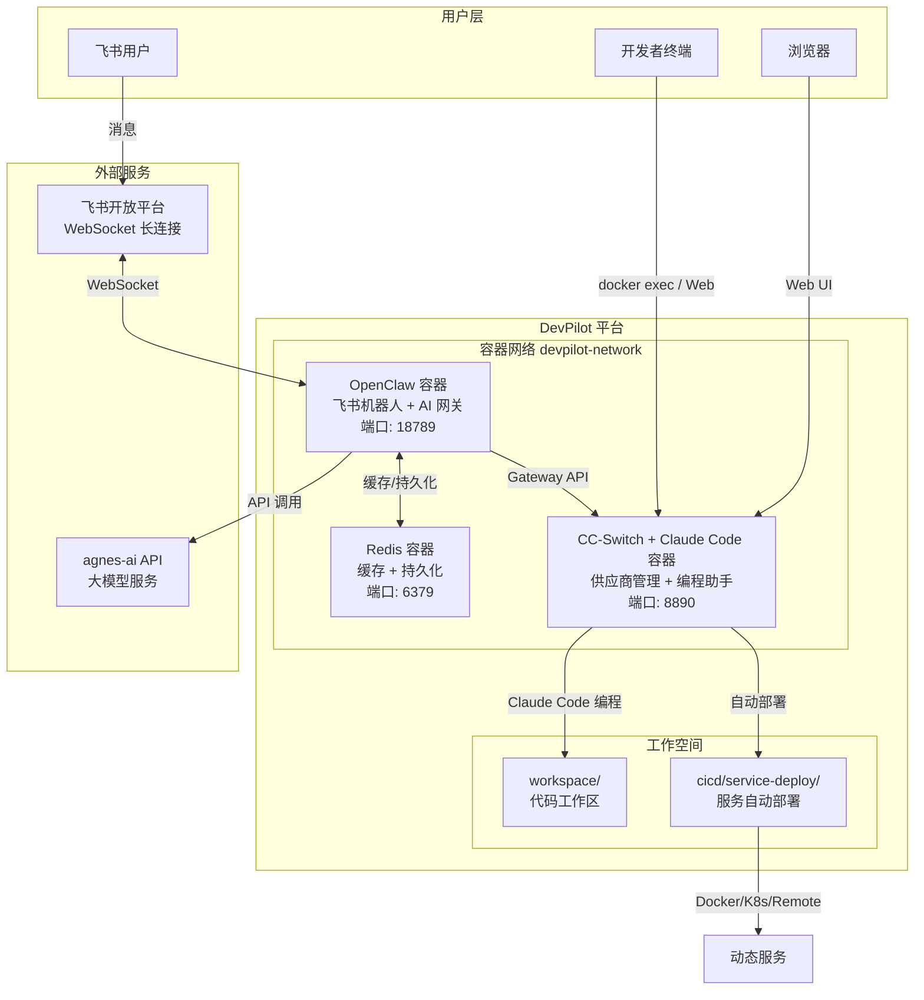

### 3.2 组件关系图

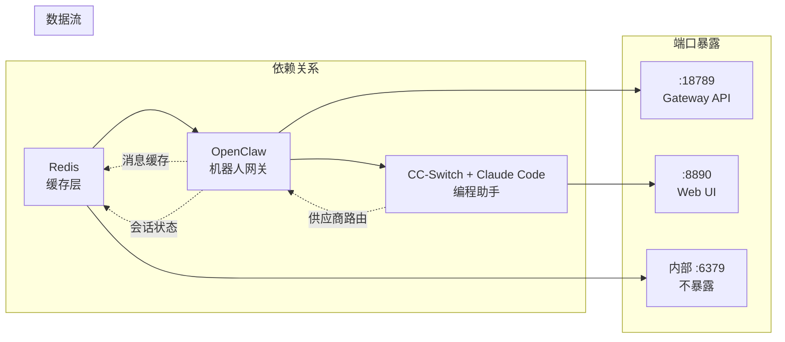

**设计决策说明：**

- **Redis 作为基础层**：OpenClaw 依赖 Redis 进行消息缓存和会话状态持久化，因此 Redis 必须先启动并通过健康检查后，OpenClaw 才会启动（`depends_on: condition: service_healthy`）。
- **CC-Switch 依赖 OpenClaw**：CC-Switch 容器通过 `depends_on: condition: service_started` 依赖 OpenClaw，确保网络可达。CC-Switch 可以通过 OpenClaw Gateway 进行 AI 模型路由，也可以直连 agnes-ai API（fallback 模式）。
- **端口隔离**：Redis 仅在容器网络内部通信，不暴露宿主机端口，降低攻击面。

### 3.3 部署架构

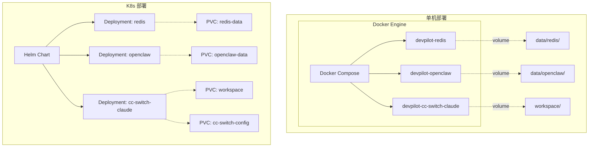

**单机部署设计**：使用 Docker Compose 编排，数据通过 bind mount 挂载到宿主机目录（`data/`、`logs/`、`workspace/`），确保容器重建后数据不丢失。

**K8s 部署设计**：使用 Helm Chart 模板化部署，数据通过 PVC 持久化，支持动态 StorageClass 分配。三个 Deployment 均采用 `strategy: Recreate` 策略（单副本场景下避免双写冲突）。

### 3.4 网络架构

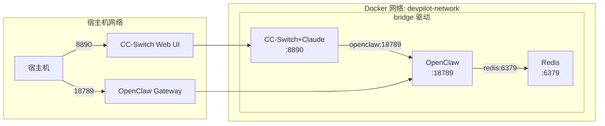

**网络设计决策：**

1. **统一 bridge 网络**：所有容器加入 `devpilot-network` bridge 网络，通过容器名（`redis`、`openclaw`、`cc-switch-claude`）进行 DNS 解析和内部通信。
2. **最小端口暴露**：仅暴露 OpenClaw Gateway（18789）和 CC-Switch Web UI（8890）两个端口到宿主机，Redis 不暴露。
3. **动态服务共享网络**：由 Claude Code 开发的动态服务也加入 `devpilot-network`，可直接访问平台内的 Redis 和其他服务。

---

## 4. 组件设计

### 4.1 Redis 容器

#### 4.1.1 职责

Redis 是平台的缓存与持久化基础层，主要服务于 OpenClaw：

- **消息缓存**：缓存飞书消息上下文，加速 AI 对话的上下文检索。
- **会话状态**：存储用户会话状态，支持多轮对话上下文保持。
- **任务队列**：为 OpenClaw 的异步任务处理提供轻量队列能力。

#### 4.1.2 镜像与配置

| 配置项 | 值 | 说明 |
|--------|---|------|
| 基础镜像 | `redis:8.8.1-alpine` | Alpine 版本，体积小（约 40MB） |
| 容器名 | `devpilot-redis` | 固定名称，便于网络 DNS 解析 |
| 重启策略 | `unless-stopped` | 非正常退出自动重启 |
| 配置文件 | `conf/redis/redis.conf` | 只读挂载到 `/usr/local/etc/redis/redis.conf` |
| 数据卷 | `./data/redis:/data` | AOF + RDB 持久化文件 |
| 日志卷 | `./logs/redis:/logs` | Redis 运行日志 |
| 资源限制 | 512MB | 内存上限 |

#### 4.1.3 Redis 配置文件关键参数

```ini
# 网络
bind 0.0.0.0
protected-mode yes
port 6379
tcp-keepalive 300

# AOF 持久化（每秒刷盘，兼顾性能与安全）
appendonly yes
appendfsync everysec
auto-aof-rewrite-percentage 100
auto-aof-rewrite-min-size 64mb

# RDB 快照（三级触发策略）
save 900 1       # 15分钟内至少1个key变化
save 300 10      # 5分钟内至少10个key变化
save 60 10000    # 1分钟内至少10000个key变化

# 内存管理
maxmemory 512mb
maxmemory-policy allkeys-lru

# 慢查询日志
slowlog-log-slower-than 10000   # 10ms
slowlog-max-len 128
```

**设计决策说明：**

- **双持久化策略**：同时启用 AOF 和 RDB。AOF（`everysec` 策略）最多丢失 1 秒数据，RDB 作为冷备快照。这是 Redis 官方推荐的生产级配置。
- **allkeys-lru 淘汰策略**：当内存达到 512MB 上限时，优先淘汰最近最少使用的 key，适合缓存场景。
- **密码通过命令行注入**：不硬编码在配置文件中，通过 `--requirepass "${REDIS_PASSWORD}"` 在启动命令中注入，密码由环境变量提供。

#### 4.1.4 健康检查

```yaml
healthcheck:
  test: ["CMD", "redis-cli", "-a", "${REDIS_PASSWORD}", "ping"]
  interval: 10s
  timeout: 5s
  retries: 5
  start_period: 10s
```

**设计决策**：10 秒检查间隔是 Redis 健康检查的推荐值--足够频繁以快速发现问题，又不会对 Redis 造成负担。`start_period: 10s` 给 Redis 足够的启动加载时间（加载 AOF 文件可能需要数秒）。

#### 4.1.5 依赖关系

Redis 是整个平台的启动基石，无前置依赖。OpenClaw 通过 `depends_on: condition: service_healthy` 等待 Redis 健康检查通过后才启动。

---

### 4.2 OpenClaw 容器

#### 4.2.1 职责

OpenClaw 是平台的 AI 网关和飞书机器人接入层：

- **飞书消息接入**：通过 WebSocket 长连接接收飞书消息，无需公网回调地址。
- **AI 模型调度**：将用户消息路由到 agnes-ai 大模型，获取 AI 回复。
- **Gateway API**：提供 HTTP 网关接口，供其他容器（如 CC-Switch）调用 AI 能力。
- **技能调度**：加载和管理 AI 研发流程技能文件，按需触发对应技能。

#### 4.2.2 镜像与配置

| 配置项 | 值 | 说明 |
|--------|---|------|
| 基础镜像 | `node:22.23.1-bookworm` | Node.js 22 LTS，Debian Bookworm |
| 安装组件 | `openclaw@2026.7.1-2` | 通过 npm 全局安装 |
| 容器名 | `devpilot-openclaw` | 固定名称 |
| 重启策略 | `unless-stopped` | - |
| 工作目录 | `/app` | 配置文件存放位置 |
| 数据卷 | `./data/openclaw:/data/openclaw` | OpenClaw 配置和运行时数据 |
| 日志卷 | `./logs/openclaw:/logs` | - |
| 端口映射 | `${OPENCLAW_GATEWAY_PORT}:18789` | Gateway API 端口 |
| 资源限制 | 768MB | - |

#### 4.2.3 Dockerfile 设计

```dockerfile
ARG NODE_IMAGE_TAG=22.23.1-bookworm
FROM node:${NODE_IMAGE_TAG}

# 系统依赖（合并为单层，减少镜像层数）
RUN apt-get update && apt-get install -y --no-install-recommends \
    curl ca-certificates && rm -rf /var/lib/apt/lists/*

# 时区设置
ENV TZ=Asia/Shanghai
RUN ln -snf /usr/share/zoneinfo/$TZ /etc/localtime && echo $TZ > /etc/timezone

# 安装 OpenClaw（BuildKit 缓存挂载加速重建）
ARG OPENCLAW_VERSION=2026.7.1-2
RUN --mount=type=cache,target=/root/.npm \
    npm install -g openclaw@${OPENCLAW_VERSION}

# 配置文件与启动脚本
COPY conf/openclaw/openclaw.default.json /app/conf/
COPY conf/openclaw/init-openclaw.sh /app/conf/

EXPOSE 18789
CMD ["/app/conf/init-openclaw.sh"]
```

**Dockerfile 设计决策：**

1. **build-arg 参数化版本**：通过 `ARG` 接收版本号，实现版本号与 Dockerfile 解耦。版本号统一从 `versions.env` 文件读取，通过 `docker-compose.yml` 的 `build.args` 传入。
2. **BuildKit 缓存挂载**：`--mount=type=cache,target=/root/.npm` 将 npm 缓存挂载为持久化缓存层，重复构建时利用缓存加速依赖安装。
3. **合并 RUN 层**：系统依赖安装与时区设置合并为单个 RUN 指令，减少镜像层数。每多一层会增加约 4KB 的元数据开销并增加构建时间。
4. **Windows 换行符修复**：`sed -i 's/\r$//'` 确保 Windows 开发环境下编写的脚本在 Linux 容器中正确执行。

#### 4.2.4 初始化启动脚本设计

OpenClaw 的启动脚本 `init-openclaw.sh` 实现了**首次启动配置生成**机制：

1. 检查 `/data/openclaw/openclaw.json` 是否存在。
2. 若不存在（首次启动），从模板 `openclaw.default.json` 复制，并通过 `sed` 替换占位符为实际环境变量值。
3. 检查并安装飞书插件。
4. 启动 OpenClaw Gateway。

**配置模板设计**：`openclaw.default.json` 使用 `{{占位符}}` 语法（如 `{{AGNES_API_KEY}}`），在容器启动时由 `sed` 替换为实际值。这种设计实现了配置与代码分离--模板文件在镜像构建时打包，实际值在运行时注入。

#### 4.2.5 健康检查

```yaml
healthcheck:
  test: ["CMD", "curl", "-f", "http://127.0.0.1:18789/healthz"]
  interval: 30s
  timeout: 10s
  retries: 3
  start_period: 60s
```

**设计决策**：`start_period: 60s` 较长，因为 OpenClaw 启动时需要加载配置、安装飞书插件、建立 WebSocket 连接，冷启动可能需要 30-50 秒。30 秒检查间隔避免频繁请求对 Gateway 造成压力。

#### 4.2.6 依赖关系

- **前置依赖**：Redis（`condition: service_healthy`）--必须等待 Redis 健康检查通过后才启动。
- **被依赖**：CC-Switch 容器（`condition: service_started`）--CC-Switch 在 OpenClaw 启动后即可启动，无需等待健康检查。

---

### 4.3 CC-Switch + Claude Code 容器

#### 4.3.1 职责

CC-Switch + Claude Code 是一个合体容器，承担两个角色：

- **CC-Switch Web**：AI 供应商管理 Web 界面，管理 Claude Code 的模型供应商配置，支持多供应商切换和 takeover 模式。
- **Claude Code**：终端 AI 编程助手，在容器内直接操作 `workspace/` 目录中的代码，进行代码生成、重构、调试等开发工作。

#### 4.3.2 镜像与配置

| 配置项 | 值 | 说明 |
|--------|---|------|
| 基础镜像 | `node:22.23.1-bookworm` | 与 OpenClaw 统一基础镜像 |
| 安装组件 | `cc-switch-web@v0.21.0` + `@anthropic-ai/claude-code@2.1.220` | - |
| 容器名 | `devpilot-cc-switch-claude` | 固定名称 |
| 重启策略 | `unless-stopped` | - |
| 工作目录 | `/workspace` | 代码工作区 |
| Home 目录 | `/home/node` | CC-Switch 配置存储位置 |
| 工作区卷 | `./workspace:/workspace` | 开发代码持久化 |
| 数据卷 | `./data/cc-switch-claude:/home/node` | CC-Switch 配置持久化 |
| 日志卷 | `./logs/cc-switch-claude:/logs` | - |
| 端口映射 | `${CC_SWITCH_WEB_PORT}:${CC_SWITCH_WEB_PORT}` | Web UI 端口 |
| 资源限制 | 768MB | - |
| 交互模式 | `stdin_open: true, tty: true` | Claude Code 需要交互式终端 |

#### 4.3.3 Dockerfile 设计

```dockerfile
ARG NODE_IMAGE_TAG=22.23.1-bookworm
FROM node:${NODE_IMAGE_TAG}

# 版本参数
ARG CC_SWITCH_VERSION=v0.21.0
ARG CLAUDE_CODE_VERSION=2.1.220

# 系统依赖（含 git，Claude Code 需要）
RUN apt-get update && apt-get install -y --no-install-recommends \
    git curl ca-certificates openssh-client vim \
    && ln -snf /usr/share/zoneinfo/$TZ /etc/localtime \
    && rm -rf /var/lib/apt/lists/*

# 下载 CC-Switch Web 二进制
RUN curl -fsSL \
    "https://github.com/Laliet/cc-switch-web/releases/download/${CC_SWITCH_VERSION}/cc-switch-server-linux-x86_64" \
    -o /usr/local/bin/cc-switch-web && chmod +x /usr/local/bin/cc-switch-web

# 安装 Claude Code
RUN --mount=type=cache,target=/root/.npm \
    npm install -g @anthropic-ai/claude-code@${CLAUDE_CODE_VERSION}

WORKDIR /workspace
ENV HOME=/home/node
CMD ["/usr/local/bin/start.sh"]
```

**Dockerfile 设计决策：**

1. **合体容器设计**：将 CC-Switch 和 Claude Code 放在同一容器中，而非拆分为两个容器。理由是 CC-Switch 的核心功能是为 Claude Code 管理供应商配置，二者通过本地文件系统（`~/.cc-switch/config.json`）紧耦合通信，拆分会引入不必要的网络开销和配置同步复杂度。
2. **CC-Switch Web 通过 curl 下载**：CC-Switch 是预编译的二进制文件，直接从 GitHub Releases 下载，不需要 Node.js 编译环境。版本通过 build-arg 参数化。
3. **系统依赖包含 git 和 openssh-client**：Claude Code 需要执行 `git` 命令进行版本控制，openssh-client 用于访问私有 Git 仓库。
4. **非 root 用户目录设置**：`chown -R node:node /home/node` 确保 node 用户对配置目录有写权限（当前镜像以 root 运行，为后续非 root 运行做预留）。

#### 4.3.4 启动脚本设计

`start.sh` 的启动流程：

```
1. 后台启动 CC-Switch Web -> 等待 Web 就绪
2. 检查 ~/.cc-switch/config.json 是否存在
   -> 不存在：自动写入 agnes-ai 供应商配置（首次初始化）
   -> 已存在：跳过，保留用户自定义配置
3. 读取并显示 Web 访问密码
4. 若 DEVPILOT_AUTO_DEPLOY=true，执行 post-dev-hook.sh
5. 打印使用说明
6. wait ${CC_SWITCH_PID} 保持容器运行
```

**自动配置设计决策**：CC-Switch 供应商配置仅在首次启动时写入，后续重启不覆盖。这保证了用户通过 Web UI 修改的配置不会因容器重启而丢失。自动配置内容从环境变量（`AGNES_BASE_URL`、`AGNES_API_KEY`、`ANTHROPIC_MODEL`）读取，实现零手动配置。

#### 4.3.5 健康检查

```yaml
healthcheck:
  test: ["CMD", "curl", "-sf", "http://127.0.0.1:${CC_SWITCH_WEB_PORT}"]
  interval: 30s
  timeout: 10s
  retries: 3
  start_period: 30s
```

#### 4.3.6 依赖关系

- **前置依赖**：OpenClaw（`condition: service_started`）--仅需 OpenClaw 容器启动，不需要等待其健康检查。
- **被依赖**：无。CC-Switch 是启动链的末端。
- **工作区挂载**：`workspace/` 目录同时挂载到容器内和宿主机，Claude Code 开发的代码直接持久化在宿主机，也可通过 `cicd/service-deploy/` 脚本自动部署。

---

## 5. 数据流设计

### 5.1 消息流（飞书 -> OpenClaw -> agnes-ai -> 回复）

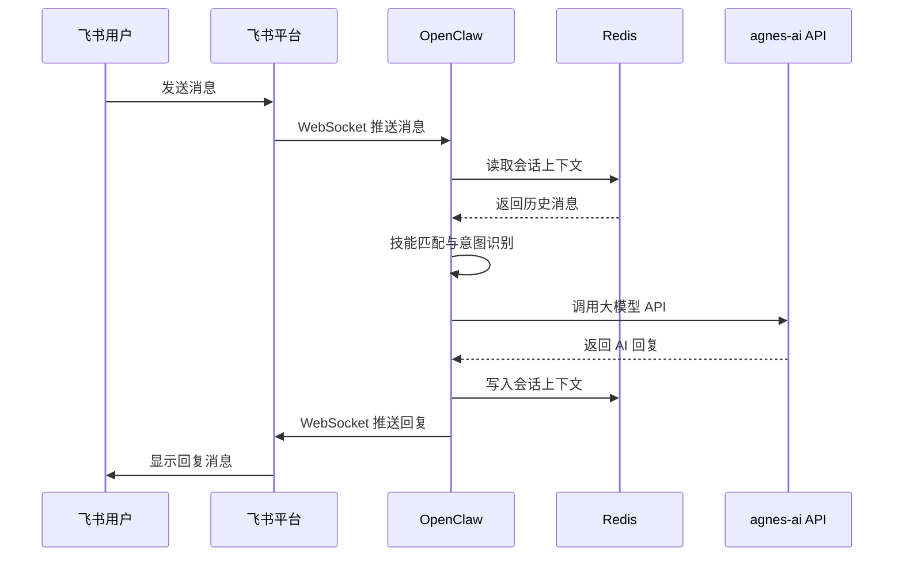

**消息流设计说明：**

1. **WebSocket 长连接模式**：OpenClaw 通过 WebSocket 与飞书平台建立长连接，无需公网回调地址。这是选择飞书"企业自建应用 + 长连接模式"的核心原因--降低了网络配置复杂度，尤其适合内网部署场景。
2. **Redis 会话上下文**：每条飞书消息处理后，OpenClaw 将会话上下文（用户 ID、消息历史、技能状态）写入 Redis，实现多轮对话的上下文保持。
3. **技能调度**：OpenClaw 加载 `~/.openclaw/skills/` 下的技能文件，根据用户消息内容匹配技能触发条件，执行对应的技能流程。例如，收到新项目需求时触发"需求探索"技能（G1 门控）。

### 5.2 开发流（Claude Code -> workspace -> 部署）

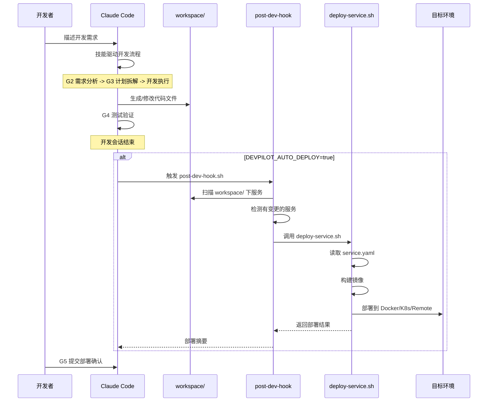

**开发流设计说明：**

1. **技能驱动的研发闭环**：Claude Code 在容器内运行，通过技能文件（skills/*.md）指导研发流程。7 个技能文件对应 7 个研发阶段，每个阶段有明确的输入输出和 HITL 门控点（G1-G5）。
2. **workspace 作为代码中枢**：所有开发产物（代码、配置、service.yaml）存放在 `workspace/` 目录，该目录同时挂载到容器内（供 Claude Code 操作）和宿主机（供部署脚本读取）。
3. **自动部署钩子**：当 `DEVPILOT_AUTO_DEPLOY=true` 时，Claude Code 开发会话结束后自动触发 `post-dev-hook.sh`，扫描 workspace 下有变更的服务并自动部署。变更检测通过比较文件修改时间与上次部署时间戳实现。

### 5.3 数据持久化流

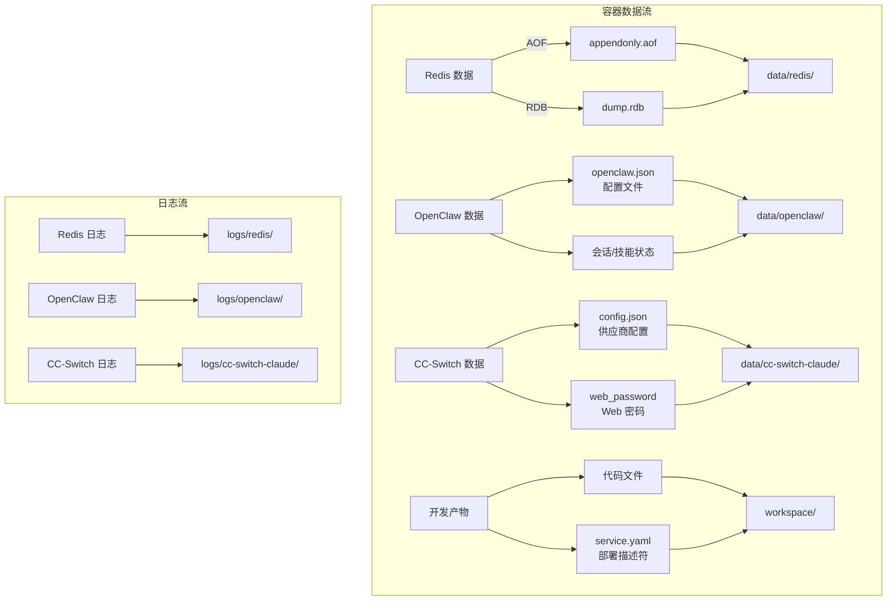

**数据持久化设计说明：**

| 数据类型 | 存储位置 | 持久化方式 | 说明 |
|---------|---------|-----------|------|
| Redis 数据 | `data/redis/` | AOF + RDB 双持久化 | 容器重建后自动加载，最多丢失 1 秒数据 |
| OpenClaw 配置 | `data/openclaw/openclaw.json` | 文件持久化 | 首次启动从模板生成，后续保留用户修改 |
| CC-Switch 配置 | `data/cc-switch-claude/.cc-switch/` | 文件持久化 | 供应商配置和 Web 密码 |
| 开发代码 | `workspace/` | Bind mount | Claude Code 直接操作，部署脚本读取 |
| 运行日志 | `logs/{容器名}/` | Docker json-file 驱动 | 日志轮转：max-size 10m，max-file 3 |

---

## 6. 配置设计

### 6.1 环境变量设计

DevPilot 共有 14 个环境变量，按使用方式分为三类：

#### 6.1.1 必填变量（用户提供，3 个）

| 变量名 | 说明 | 获取方式 |
|--------|------|---------|
| `AGNES_API_KEY` | agnes-ai 大模型 API 密钥 | agnes-ai 平台获取 |
| `FEISHU_APP_ID` | 飞书应用 App ID | 飞书开放平台创建应用后获取 |
| `FEISHU_APP_SECRET` | 飞书应用 App Secret | 飞书开放平台创建应用后获取 |

**设计决策**：必填项从最初设计的 5 个降至 3 个，核心策略是将密码类变量改为自动生成。用户只需关注与外部服务相关的凭证，降低了配置门槛。

#### 6.1.2 自动生成变量（2 个）

| 变量名 | 说明 | 生成方式 |
|--------|------|---------|
| `REDIS_PASSWORD` | Redis 认证密码 | `openssl rand -hex 16`（32 字符十六进制） |
| `OPENCLAW_GATEWAY_TOKEN` | OpenClaw Gateway 认证 Token | `openssl rand -hex 16`（32 字符十六进制） |

**三层自动生成机制**：

1. **init.sh（配置向导）**：交互式配置时自动生成密码并写入 .env。
2. **deploy.sh（部署脚本）**：检测到 .env 中密码仍为占位符时，自动生成替换。
3. **.env.example（配置模板）**：明确标注 `[自动]` 和占位符 `change-me-to-*`。

```bash
# 密码生成函数（cicd/lib/common.sh）
gen_password() {
    local length="${1:-32}"
    openssl rand -hex $((length / 2)) 2>/dev/null || \
    head -c "${length}" /dev/urandom | xxd -p | tr -d '\n' | head -c "${length}"
}
```

**设计决策**：使用 `openssl rand -hex` 作为主生成方式（安全、高性能），`/dev/urandom` 作为 fallback（兼容无 openssl 的环境）。32 字符十六进制提供 128 位熵，满足生产级安全要求。

#### 6.1.3 可选变量（有默认值，9 个）

| 变量名 | 默认值 | 说明 |
|--------|-------|------|
| `AGNES_BASE_URL` | `https://apihub.agnes-ai.com/v1` | agnes-ai API 地址 |
| `AGNES_MODEL_FLASH` | `agnes-2.0-flash` | 默认模型名称 |
| `OPENCLAW_GATEWAY_PORT` | `18789` | OpenClaw Gateway 端口 |
| `CC_SWITCH_WEB_PORT` | `8890` | CC-Switch Web UI 端口 |
| `TZ` | `Asia/Shanghai` | 时区 |
| `DEVPILOT_AUTO_DEPLOY` | `false` | 是否启用自动部署 |
| `NODE_IMAGE_TAG` | `22.23.1-bookworm` | Node.js 镜像版本 |
| `OPENCLAW_VERSION` | `2026.7.1-2` | OpenClaw 版本 |
| `CC_SWITCH_VERSION` | `v0.21.0` | CC-Switch 版本 |
| `CLAUDE_CODE_VERSION` | `2.1.220` | Claude Code 版本 |

### 6.2 版本管理设计

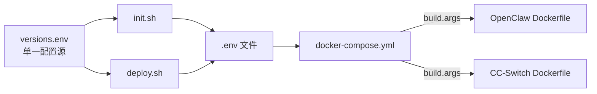

**设计决策：versions.env 作为单一配置源**

所有版本号集中在 `versions.env` 文件中管理，理由：

1. **避免多处同步**：版本号若分散在 docker-compose.yml、Dockerfile、CI workflow 中，升级版本时需要修改 4-5 处，容易遗漏。
2. **init.sh 自动加载**：`source ./versions.env` 将版本号导入环境变量，写入 .env 文件。
3. **Dockerfile 通过 build-arg 接收**：docker-compose.yml 的 `build.args` 将版本号传入 Dockerfile 的 `ARG`，实现版本号在构建时注入。

```ini
# versions.env
NODE_IMAGE_TAG=22.23.1-bookworm
OPENCLAW_VERSION=2026.7.1-2
CC_SWITCH_VERSION=v0.21.0
CLAUDE_CODE_VERSION=2.1.220
```

### 6.3 配置模板设计

DevPilot 提供两种配置方式，均以 `.env.example` 为基础：

**方式 1（推荐）：交互式配置向导 init.sh**

```
./init.sh
-> 引导填写 3 个必填项
-> 自动生成密码
-> 自动加载版本号
-> 生成 .env 文件
-> 打印配置摘要和下一步指引
```

**方式 2：手动编辑**

```bash
cp .env.example .env
vim .env  # 填入必填项
./deploy.sh  # 部署脚本会自动生成密码
```

**配置模板标记体系**：

| 标记 | 含义 | 变量数量 |
|------|------|---------|
| `[必填]` | 用户必须手动填入实际值 | 3 |
| `[自动]` | 首次部署时自动生成 | 2 |
| `[可选]` | 有默认值，按需修改 | 9 |

---

## 7. 部署设计

### 7.1 部署方式总览

DevPilot 提供 4 种部署方式，通过统一入口 `cicd/scripts/deploy.sh` 管理：

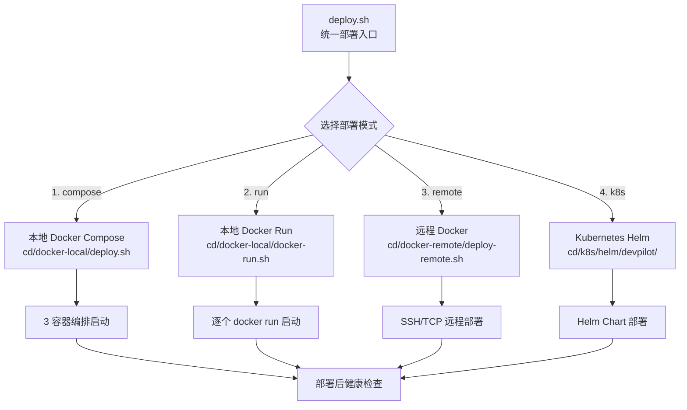

### 7.2 Docker Compose 部署设计

Docker Compose 是推荐的部署方式，核心设计如下：

**启动依赖链**：Redis（healthy）-> OpenClaw（started）-> CC-Switch（started）

```yaml
redis:
  # 基础层，无依赖

openclaw:
  depends_on:
    redis:
      condition: service_healthy  # 等 Redis 健康检查通过

cc-switch-claude:
  depends_on:
    openclaw:
      condition: service_started   # 等 OpenClaw 启动即可
```

**设计决策**：使用 `condition` 而非简单的 `depends_on` 列表，确保依赖不仅是"启动顺序"而是"就绪状态"。Redis 的 `service_healthy` 条件确保 OpenClaw 启动时 Redis 已可读写，避免连接失败。

### 7.3 Docker Compose Profiles 设计

```yaml
redis:
  profiles: ["", "full", "bot"]    # 默认 + full + bot

openclaw:
  profiles: ["", "full", "bot"]    # 默认 + full + bot

cc-switch-claude:
  profiles: ["", "full", "dev"]    # 默认 + full + dev
```

| Profile | 启动容器 | 使用场景 | 命令 |
|---------|---------|---------|------|
| 默认 / full | Redis + OpenClaw + CC-Switch | 完整功能 | `docker compose up -d` |
| bot | Redis + OpenClaw | 仅飞书 AI 机器人 | `docker compose --profile bot up -d` |
| dev | CC-Switch + Claude Code | 仅编程助手 | `docker compose --profile dev up -d` |

**设计决策**：空字符串 `""` 作为默认 profile，使 `docker compose up -d` 无需指定 `--profile` 即可启动全部容器。三个 profile 覆盖了三种典型使用场景，避免用户启动不需要的容器浪费资源。

### 7.4 本地 Docker Run 部署设计

`docker-run.sh` 提供不依赖 Docker Compose 的原生 docker run 部署方式，适用于：

- Docker Compose 不可用的环境（旧版 Docker）
- 需要精细控制容器启动参数的场景
- 调试和排查问题

**设计要点**：

1. **手动创建网络**：`ensure_docker_network "devpilot-network"` 确保网络存在（幂等操作）。
2. **手动构建镜像**：使用 `docker build` 逐个构建 OpenClaw 和 CC-Switch 镜像，同时打 `latest` 和版本号标签。
3. **手动清理旧容器**：`remove_container_if_exists` 在启动前清理同名旧容器（幂等）。
4. **逐步等待就绪**：每个容器启动后使用 `wait_for_*` 函数等待就绪，再启动下一个。

### 7.5 远程 Docker 部署设计

`deploy-remote.sh` 支持三种远程连接方式：

| 连接方式 | 格式 | 适用场景 |
|---------|------|---------|
| TCP 明文 | `tcp://remote:2375` | 内网环境（不推荐公网使用） |
| SSH 直连 | `ssh://user@remote` | 标准远程部署（推荐） |
| SSH 隧道 | 配置 `docker-remote.conf` | 需要跳板机的复杂网络 |

**设计决策**：通过 `DOCKER_HOST` 环境变量切换 Docker 客户端的目标守护进程，无需在远程安装 DevPilot 代码。镜像通过 `docker save` / `scp` / `docker load` 传输到远程主机。

### 7.6 Kubernetes Helm 部署设计

DevPilot 的 K8s 部署**仅支持 Helm Chart 方式**（不提供 kubectl 原生清单），理由：

1. **配置参数化**：Helm Chart 的 `values.yaml` 提供完整的参数化配置，避免手动编辑 YAML。
2. **生命周期管理**：`helm upgrade --install` 实现幂等部署和滚动更新。
3. **模板复用**：通过 `_helpers.tpl` 定义通用标签和名称模板，确保资源命名一致性。

#### Helm Chart 结构

```
cicd/cd/k8s/helm/devpilot/
├── Chart.yaml          # Chart 元数据
├── values.yaml         # 默认配置值
└── templates/
    ├── _helpers.tpl    # 辅助函数（名称、标签）
    ├── deployment.yaml # 3 个 Deployment + PVC
    ├── service.yaml    # Service 定义
    ├── configmap.yaml  # 非敏感配置
    ├── secret.yaml     # 敏感配置（密码、密钥）
    └── ingress.yaml    # Ingress 配置（可选）
```

#### 资源设计

| K8s 资源 | 数量 | 说明 |
|---------|------|------|
| Deployment | 3 | Redis、OpenClaw、CC-Switch 各一个 |
| Service | 3 | 每个 Deployment 对应一个 Service |
| ConfigMap | 1 | 非敏感配置（时区、端口、URL 等） |
| Secret | 1 | 敏感配置（API Key、密码、Token） |
| PVC | 4 | Redis 数据、OpenClaw 数据、workspace、CC-Switch 配置 |
| Ingress | 可选 | 域名访问配置 |

#### 配置注入设计

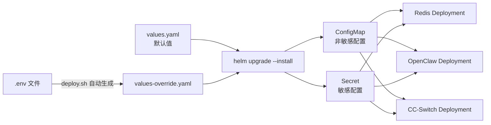

**设计决策**：统一部署脚本 `deploy.sh` 从 `.env` 文件自动生成 `values-override.yaml`，用户无需手动编写 Helm values。敏感配置（API Key、密码）通过 Secret 注入，非敏感配置（端口、时区、URL）通过 ConfigMap 注入。支持 `externalSecret` 引用外部 Secret 管理系统（如 External Secrets Operator）。

#### Init Container 设计

OpenClaw Deployment 使用 init container 等待 Redis 就绪：

```yaml
initContainers:
  - name: wait-for-redis
    image: redis:8.8.1-alpine
    command:
      - sh
      - -c
      - >-
        until redis-cli -h devpilot-redis -a "$(REDIS_PASSWORD)" ping | grep PONG;
        do echo "等待 Redis 就绪 ..."; sleep 3; done;
```

**设计决策**：K8s 中 Service DNS 解析在 Pod 启动时即可用，但 Redis 容器可能尚未完成初始化。Init container 通过轮询 `redis-cli ping` 确保 Redis 就绪后才启动 OpenClaw 主容器，复刻了 Docker Compose 的 `depends_on: condition: service_healthy` 语义。

---

## 8. CI/CD 设计

### 8.1 CI 架构设计

DevPilot 的 CI 流水线支持三个平台对称结构，按需复制：

| CI 平台 | 配置文件位置 | 说明 |
|---------|-------------|------|
| GitHub Actions | `cicd/ci/github/workflows/ci.yml` | 默认平台，推送到 GHCR |
| Gitee Go | `cicd/ci/gitee/workflows/ci.yml` | 国内镜像，推送到 ACR |
| GitLab CI | `cicd/ci/gitlab/.gitlab-ci.yml` | 自建 GitLab 场景 |

#### CI 流水线阶段

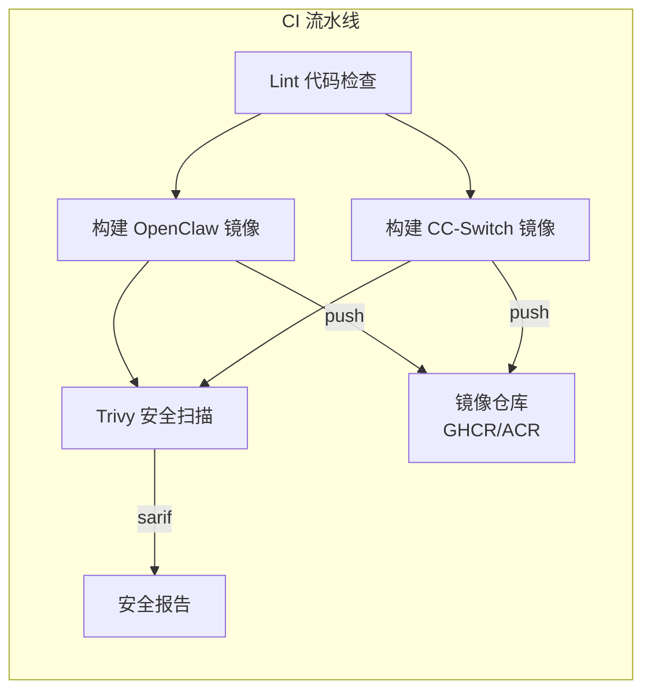

**CI 流水线设计：**

1. **Lint 阶段**：检查 Shell 脚本语法（`bash -n`）、Dockerfile 存在性、docker-compose.yml 语法、.env.example 变量完整性。
2. **构建阶段**：两个镜像（OpenClaw、CC-Switch）并行构建，使用 `docker/build-push-action` + BuildKit 缓存（`cache-from: type=gha`）。
3. **推送阶段**：仅在 push 到主分支时推送镜像到 GHCR，PR 仅构建不推送。镜像标签策略：分支名 + sha 前缀 + latest（默认分支）。
4. **安全扫描**：使用 Trivy 扫描镜像漏洞（CRITICAL/HIGH 级别），结果以 SARIF 格式上传到 GitHub Security 面板。同时扫描文件系统检查配置安全。

**设计决策**：Lint 阶段检查 .env.example 变量完整性，确保新增环境变量时不会遗漏模板更新。这是一个"防遗忘"设计--如果开发者新增了环境变量但忘记更新 .env.example，CI 会直接失败。

### 8.2 CD 架构设计

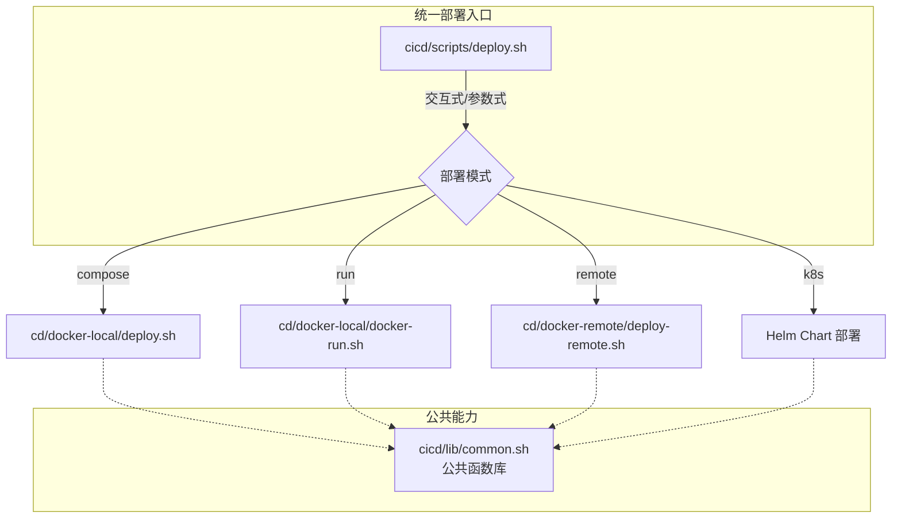

**CD 架构设计要点：**

1. **统一入口**：`deploy.sh` 支持 `--mode <compose|run|remote|k8s>` 参数式调用和交互式选择两种模式。
2. **非交互模式**：通过 `--mode` 参数支持 CI/CD 自动化调用，无需人工交互。
3. **公共函数复用**：所有部署脚本通过 `source cicd/lib/common.sh` 加载公共函数，消除重复代码。
4. **部署后健康检查**：所有部署模式执行后自动进行健康检查（Docker 模式检查容器状态，K8s 模式检查 Pod 就绪状态）。

### 8.3 服务自动部署设计

服务自动部署是 DevPilot 的核心差异化能力--Claude Code 开发的服务可以自动构建并部署到目标环境。

#### 8.3.1 架构设计

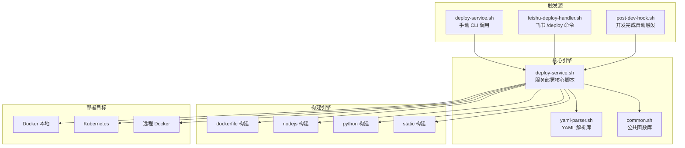

#### 8.3.2 服务描述符设计

每个可部署的服务在服务目录下放置 `service.yaml` 描述符：

```yaml
# 极简模式（仅需 name + deploy.target）
name: my-service
deploy:
  target: docker

# 完整配置
name: my-service
description: "示例服务"
build:
  type: dockerfile          # dockerfile | nodejs | python | static（自动推断）
  context: .
  dockerfile: Dockerfile
  args:
    - NODE_ENV=production
deploy:
  target: docker            # docker | k8s | remote
  docker:
    container_name: my-service
    network: devpilot-network
    ports:
      - "8080:8080"
    env:
      - LOG_LEVEL=info
    volumes:
      - ./data:/app/data
    restart: unless-stopped
    memory_limit: 512M
healthcheck:
  type: http                # http | tcp | command
  path: /health
  port: 8080
  interval: 10s
  retries: 5
  start_period: 30s
```

**设计决策：构建类型自动推断**：当 `build.type` 未指定时，`deploy-service.sh` 根据服务目录中的文件特征自动推断：
- 存在 `Dockerfile` -> `dockerfile` 构建
- 存在 `package.json` -> `nodejs` 构建（使用内置 Node.js Dockerfile）
- 存在 `requirements.txt` -> `python` 构建（使用内置 Python Dockerfile）
- 以上都不存在 -> `static` 构建（使用 nginx 提供静态文件）

这使开发者可以仅提供源码和 `service.yaml`（2 行配置）即可完成部署，无需编写 Dockerfile。

#### 8.3.3 飞书部署命令设计

`feishu-deploy-handler.sh` 支持通过飞书消息远程管理服务：

| 命令 | 功能 |
|------|------|
| `/deploy <service-name>` | 部署指定服务 |
| `/deploy <service-name> --tag v1.0` | 指定标签部署 |
| `/deploy --list` | 列出所有可部署服务 |
| `/deploy --status <service-name>` | 查看服务状态 |
| `/deploy --logs <service-name>` | 查看服务日志 |
| `/deploy --restart <service-name>` | 重启服务 |
| `/deploy --cleanup <service-name>` | 清理服务 |

**设计决策**：飞书命令处理器同时支持 Docker 和 K8s 后端。状态查询和日志查看会自动检测服务运行在哪个后端（Docker 容器或 K8s Deployment），输出格式化为飞书消息卡片。

### 8.4 公共函数库设计

`cicd/lib/common.sh` 是所有部署/CI/CD 脚本的公共基础库，统一提供以下能力：

| 能力分类 | 函数/常量 | 说明 |
|---------|----------|------|
| 颜色常量 | `RED` `GREEN` `YELLOW` `BLUE` `CYAN` `MAGENTA` `NC` | 终端彩色输出 |
| 日志函数 | `info` `success` `warn` `error` `die` | 统一日志格式 |
| 格式函数 | `print_separator` `print_header` | 分隔线和标题 |
| 路径定位 | `get_project_root` | 自动查找项目根目录 |
| 环境加载 | `load_env` | 加载 .env 文件并导出环境变量 |
| 环境校验 | `validate_required_vars` `validate_devpilot_env` | 校验必需变量 |
| 命令执行 | `run_cmd` | 支持 dry-run 模式的命令执行 |
| 健康检查 | `wait_for_http` `wait_for_container_http` `wait_for_redis` | HTTP/Redis 就绪检测 |
| Docker 辅助 | `ensure_docker_network` `remove_container_if_exists` `create_data_dirs` | 网络管理、容器清理、目录创建 |
| 密码生成 | `gen_password` | 安全随机密码生成 |
| 错误处理 | `setup_error_trap` | ERR 陷阱，显示出错行号 |

**设计决策：统一函数库的价值**

1. **消除重复代码**：健康检查、密码生成、环境校验等逻辑在多个脚本中复用，避免"复制粘贴"导致的维护问题。
2. **统一行为**：所有脚本的日志格式、错误处理、颜色输出一致，提升运维体验。
3. **dry-run 支持**：`run_cmd` 函数内置 dry-run 模式，所有部署操作支持"只打印不执行"，便于调试和 CI 预检。

---

## 9. 安全设计

### 9.1 密码安全

| 安全措施 | 实现方式 | 说明 |
|---------|---------|------|
| 自动生成强密码 | `openssl rand -hex 16` | 128 位熵，32 字符十六进制 |
| 密码不在配置文件硬编码 | 环境变量注入 | redis.conf 注释明确说明密码通过命令行注入 |
| 密码占位符检测 | `change-me-to-*` 模式匹配 | deploy.sh 检测到占位符时自动生成替换 |
| 密码不回显 | `sed 's/./*/g'` 全替换为星号 | init.sh 配置摘要中密码以星号显示 |
| API Key 部分遮蔽 | `sed 's/\(.\{8\}\).*/\1.../'` | 仅显示前 8 字符 |

**Redis 密码注入设计**：

```yaml
# docker-compose.yml
command: >
  redis-server /usr/local/etc/redis/redis.conf
  --requirepass "${REDIS_PASSWORD}"
```

密码通过 `--requirepass` 命令行参数注入，而非写入 `redis.conf` 文件。这确保了密码不会出现在镜像内的配置文件中，且每次部署可以使用不同密码。

### 9.2 网络安全

| 安全措施 | 实现方式 |
|---------|---------|
| Redis 不暴露端口 | docker-compose.yml 中 Redis 未配置 `ports` 映射 |
| Docker 网络隔离 | 所有容器在 `devpilot-network` bridge 网络内通信 |
| Redis protected-mode | `protected-mode yes` |
| Gateway Token 认证 | OpenClaw Gateway 通过 Token 认证访问 |
| 动态服务网络隔离 | 服务部署到 `devpilot-network`，与平台共享网络 |

**设计决策**：Redis 端口不映射到宿主机是关键安全措施。Redis 仅通过容器网络内部 DNS（`redis:6379`）被 OpenClaw 访问，外部无法直接连接 Redis。这消除了 Redis 未授权访问的安全风险。

### 9.3 容器安全

| 安全措施 | 当前状态 | 说明 |
|---------|---------|------|
| 资源限制 | 已实施 | 三个容器均配置 `memory` 限制 |
| 重启策略 | 已实施 | `unless-stopped` 确保异常退出后自动重启 |
| 非 root 用户 | 规划中 | CC-Switch 容器已创建 node 用户并 chown，但未切换运行用户 |
| 只读配置挂载 | 已实施 | redis.conf 以 `:ro` 只读挂载 |
| 镜像安全扫描 | 已实施 | CI 中 Trivy 扫描 CRITICAL/HIGH 漏洞 |

### 9.4 数据安全

| 安全措施 | 实现方式 |
|---------|---------|
| Redis AOF 持久化 | `appendfsync everysec`，最多丢失 1 秒数据 |
| Redis RDB 快照 | 三级触发策略，冷备份 |
| 配置文件持久化 | OpenClaw 和 CC-Switch 配置通过 volume 持久化 |
| .env 文件不打包镜像 | .dockerignore 排除 `.env` 和 `.env.*` |
| .env.example 不含真实密钥 | 使用 `your-*` 和 `change-me-*` 占位符 |
| 备份机制 | Makefile `make backup` 命令备份 Redis RDB 和 OpenClaw 配置 |

---

## 10. 性能设计

### 10.1 资源限制策略

| 容器 | 原始限制 | 优化后限制 | 降幅 | 依据 |
|------|---------|-----------|------|------|
| Redis | 768MB | 512MB | 34% | maxmemory 设为 512MB，容器开销约 30MB |
| OpenClaw | 1GB | 768MB | 23% | Node.js + OpenClaw 运行时实测约 400-500MB |
| CC-Switch | 1GB | 768MB | 23% | Node.js + Claude Code 运行时实测约 400-500MB |
| **总计** | **2.768GB** | **2.048GB** | **26%** | 加上 Docker 开销实际需 3-4GB |

**设计决策**：资源限制基于实际运行时内存监控设定，保留约 50% 的余量。Redis 的 512MB 限制与 `maxmemory 512mb` 配置一致，确保 Redis 在 OOM 前先触发 LRU 淘汰而非被 Docker 杀死。

### 10.2 构建优化

#### 10.2.1 构建上下文优化

`.dockerignore` 排除不必要文件，将构建上下文从数百 MB 降至不足 1MB：

```gitignore
# Git
.git/
# Docker
Dockerfile*
docker-compose*.yml
# CI/CD
cicd/
# 文档
*.md
# 运行时数据
data/
logs/
backups/
workspace/
# 环境变量
.env
.env.*
```

**设计决策**：排除 `cicd/` 和 `workspace/` 是关键优化--这两个目录可能包含大量文件（CI 配置、开发代码），但 Dockerfile 构建时完全不需要。排除后构建上下文仅包含 `conf/` 目录下的配置文件，大幅减少传输时间。

#### 10.2.2 BuildKit 缓存挂载

```dockerfile
RUN --mount=type=cache,target=/root/.npm \
    npm install -g openclaw@${OPENCLAW_VERSION}
```

**设计决策**：npm 缓存挂载为 BuildKit 缓存层，重复构建时复用已下载的包。CI 环境中使用 `cache-from: type=gha` 将缓存持久化到 GitHub Actions 缓存，跨流水线复用。

#### 10.2.3 镜像层数优化

- 系统依赖安装与时区设置合并为单个 RUN 指令。
- `apt-get install` 后立即 `rm -rf /var/lib/apt/lists/*` 清理包缓存。
- 使用 `--no-install-recommends` 避免安装推荐包。

### 10.3 日志轮转

所有容器统一使用 Docker json-file 日志驱动并配置轮转：

```yaml
x-logging: &default-logging
  driver: json-file
  options:
    max-size: "10m"
    max-file: "3"
```

**设计决策**：单文件 10MB 上限 x 3 个文件 = 每容器最多 30MB 日志。三个容器最多 90MB 日志，防止日志撑满磁盘。YAML 锚点 `&default-logging` 实现配置复用，所有服务通过 `logging: *default-logging` 引用。

### 10.4 缓存策略

| 缓存层 | 机制 | 说明 |
|--------|------|------|
| Redis 缓存 | allkeys-lru 淘汰 | 内存满时自动淘汰最近最少使用的 key |
| npm 构建缓存 | BuildKit cache mount | 重复构建复用 npm 包缓存 |
| CI 构建缓存 | GitHub Actions cache | 跨流水线复用构建层缓存 |
| Docker 镜像层缓存 | Docker layer cache | 未变更的 Dockerfile 层跳过重建 |

---

## 11. 可扩展性设计

### 11.1 技能扩展

DevPilot 的 AI 研发流程通过 7 个技能文件实现，技能文件位于 `skills/` 目录：

| 技能文件 | 阶段 | 角色 | 门控 |
|---------|------|------|------|
| `explore-SKILL.md` | 需求探索 | 产品经理 / 业务分析师 | G1 |
| `prd-SKILL.md` | 需求分析 | 系统架构师 | G2 |
| `plan-SKILL.md` | 计划拆解 | 技术主管 | G3 |
| `dev-SKILL.md` | 开发执行 | 全栈工程师 | - |
| `review-SKILL.md` | 代码审查 | 质量工程师 | - |
| `test-SKILL.md` | 测试验证 | QA 工程师 | G4 |
| `deploy-SKILL.md` | 提交部署 | DevOps 工程师 | G5 |

**研发流程闭环**：


**扩展机制**：

1. **新增技能**：在 `skills/` 目录下创建新的 `*-SKILL.md` 文件，运行 `./setup-skills.sh` 安装到 `~/.openclaw/skills/`。
2. **自定义流程**：修改技能文件内容可调整 AI 在各阶段的行为和输出格式。
3. **技能组合**：技能文件之间通过门控点（G1-G5）串联，形成 HITL（人在回路）工作流。每个门控点需要用户确认后才能进入下一阶段。

### 11.2 服务部署扩展

DevPilot 的服务自动部署系统支持多种扩展方式：

**构建类型扩展**：当前支持 4 种构建类型（dockerfile、nodejs、python、static），新增类型只需在 `deploy-service.sh` 的 `build_image()` 函数中添加对应的 case 分支。

**部署目标扩展**：当前支持 3 种部署目标（docker、k8s、remote），新增目标只需添加对应的 `deploy_*()` 函数和 case 分支。

**服务描述符扩展**：`service.yaml` 的 YAML 结构可灵活扩展新字段，`yaml-parser.sh` 提供嵌套字段读取能力（`yaml_get_nested`），无需修改解析器即可添加新配置项。

### 11.3 CI/CD 平台扩展

CI 配置采用对称结构，三个平台（GitHub Actions、Gitee Go、GitLab CI）的配置文件结构一致，新增平台只需复制并适配语法：

```
cicd/ci/
├── github/workflows/ci.yml      # GitHub Actions
├── gitee/workflows/ci.yml       # Gitee Go
└── gitlab/.gitlab-ci.yml        # GitLab CI
```

服务部署的 CI 配置同样对称：

```
cicd/service-deploy/ci/
├── github/workflows/service-deploy.yml
├── gitee/workflows/service-deploy.yml
└── gitlab/.gitlab-ci-service-deploy.yml
```

---

## 12. 优化与演进

### 12.1 已实施优化总结

| 优化项 | 优化前 | 优化后 | 效果 |
|--------|--------|--------|------|
| 交互式配置向导 | 手动编辑 .env，5 个必填项 | init.sh 引导，3 个必填项 | 配置门槛降低 40% |
| 自动密码生成 | 手动设置密码 | openssl 自动生成 32 字符密码 | 消除弱密码风险 |
| Docker Compose Profiles | 全量启动 | 3 种 Profile 按需启动 | 资源按需分配 |
| Redis 资源限制 | 768MB | 512MB | 降低 34% |
| OpenClaw 资源限制 | 1GB | 768MB | 降低 23% |
| CC-Switch 资源限制 | 1GB | 768MB | 降低 23% |
| 总内存占用 | 2.768GB | 2.048GB | 降低 26% |
| 构建上下文 | 数百 MB | < 1MB | 构建传输时间减少 99% |
| .env 配置 | 14 个变量无分类 | 三类标注（必填/自动/可选） | 用户认知负荷降低 |
| 版本管理 | 多处同步 | versions.env 单一配置源 | 版本升级单点修改 |

### 12.2 后续优化路线

#### 12.2.1 短期规划（1-3 个月）

| 序号 | 优化项 | 目标 | 技术方案 |
|------|--------|------|---------|
| 1 | 镜像预构建与推送 | 部署时间从 5-10 分钟降至 1-2 分钟 | CI 构建镜像推送到 GHCR/ACR，部署时直接拉取 |
| 2 | CC-Switch 非 root 运行 | 容器安全提升 | Dockerfile 添加 USER node 指令 |
| 3 | Redis rename-command | 禁用危险命令 | redis.conf 添加 `rename-command FLUSHALL ""` |
| 4 | Docker 网络隔离 | frontend/backend 分离 | 拆分为两个网络，Redis 仅在 backend |

**短期规划设计决策**：

- **镜像预构建**：当前首次部署需要从源码构建两个镜像（OpenClaw + CC-Switch），耗时 5-10 分钟。CI 流水线已实现镜像构建和推送，部署阶段只需修改 docker-compose.yml 从 `build` 改为 `image` 拉取预构建镜像即可。
- **非 root 运行**：CC-Switch 容器已在 Dockerfile 中创建 node 用户并 chown 目录，只需添加 `USER node` 指令切换运行用户。需验证 Claude Code 和 CC-Switch Web 在非 root 用户下正常运行。
- **Redis rename-command**：禁用 `FLUSHALL`、`FLUSHDB`、`CONFIG` 等危险命令，防止误操作或恶意调用清空数据。

#### 12.2.2 中期规划（3-6 个月）

| 序号 | 优化项 | 目标 | 技术方案 |
|------|--------|------|---------|
| 5 | Prometheus + Grafana 监控 | 可观测性 | 添加监控容器，采集 Redis 和容器指标 |
| 6 | ARM64 架构支持 | 跨平台部署 | CI 多架构构建（docker buildx --platform linux/amd64,linux/arm64） |
| 7 | 多租户支持 | SaaS 化 | 基于命名空间隔离，每个租户独立 workspace 和配置 |

**中期规划设计决策**：

- **监控栈**：Prometheus 采集 Redis（redis_exporter）和容器（cAdvisor）指标，Grafana 提供可视化面板。可作为可选 Profile 启动，不影响核心功能。
- **ARM64 支持**：随着 Apple Silicon 和 ARM 服务器的普及，多架构镜像成为必需。通过 `docker buildx` 在 CI 中同时构建 amd64 和 arm64 镜像，推送多架构 manifest 到镜像仓库。
- **多租户**：基于 Kubernetes 命名空间实现租户隔离。每个租户分配独立的命名空间，通过 Helm Chart 的 `releaseName` 区分。Redis 使用多 DB 或独立实例隔离数据。

#### 12.2.3 长期规划（6-12 个月）

| 序号 | 优化项 | 目标 | 技术方案 |
|------|--------|------|---------|
| 8 | Kubernetes Operator | 自动化运维 | 开发 CRD + Operator 控制器，管理 DevPilot 实例生命周期 |
| 9 | 插件化架构 | 功能可扩展 | 定义插件接口，支持第三方扩展 AI 技能、部署目标、CI 平台 |
| 10 | 智能调度 | AI 驱动的资源优化 | 基于 AI 负载预测动态调整容器资源限制和副本数 |

**长期规划设计决策**：

- **Kubernetes Operator**：将 DevPilot 从 Helm Chart 部署升级为 Operator 管理模式。Operator 可实现自动扩缩容、自动备份恢复、版本滚动升级等运维自动化能力。用户只需创建 `DevPilot` CRD 实例，Operator 负责全部部署和运维。
- **插件化架构**：当前技能文件、构建类型、部署目标、CI 平台均为硬编码扩展点。插件化架构将这些扩展点统一为插件接口，支持动态加载第三方插件，无需修改核心代码。
- **智能调度**：利用 agnes-ai 的 AI 能力分析容器负载历史数据，预测资源需求，动态调整 Redis maxmemory、容器 memory limit 和 K8s 副本数，实现资源利用最优。

---

## 13. 附录

### 13.1 完整目录结构

```
DevPilot/
├── cicd/                          # CI/CD 配置与脚本
│   ├── cd/                        # 持续部署
│   │   ├── docker-local/          # 本地 Docker 部署
│   │   │   ├── deploy.sh          #   Docker Compose 部署脚本
│   │   │   └── docker-run.sh      #   Docker Run 部署脚本
│   │   ├── docker-remote/         # 远程 Docker 部署
│   │   │   ├── deploy-remote.sh   #   远程部署脚本
│   │   │   └── docker-remote.conf.example  # 远程配置模板
│   │   └── k8s/                   # Kubernetes 部署
│   │       └── helm/
│   │           └── devpilot/      #   Helm Chart
│   │               ├── Chart.yaml
│   │               ├── values.yaml
│   │               └── templates/
│   │                   ├── _helpers.tpl
│   │                   ├── deployment.yaml
│   │                   ├── service.yaml
│   │                   ├── configmap.yaml
│   │                   ├── secret.yaml
│   │                   └── ingress.yaml
│   ├── ci/                        # 持续集成
│   │   ├── github/workflows/ci.yml
│   │   ├── gitee/workflows/ci.yml
│   │   ├── gitlab/.gitlab-ci.yml
│   │   └── scripts/lint.sh
│   ├── lib/
│   │   └── common.sh              # 公共函数库
│   ├── scripts/
│   │   └── deploy.sh              # 统一部署入口
│   └── service-deploy/            # 服务自动部署
│       ├── deploy-service.sh      #   核心部署脚本
│       ├── post-dev-hook.sh       #   开发完成钩子
│       ├── feishu-deploy-handler.sh  # 飞书部署命令处理器
│       ├── service.yaml.example   #   服务描述符模板
│       ├── lib/
│       │   └── yaml-parser.sh     #   YAML 解析库
│       ├── k8s/
│       │   └── service-template.yaml  # K8s 服务模板
│       └── ci/                    # 服务部署 CI 配置
│           ├── github/workflows/service-deploy.yml
│           ├── gitee/workflows/service-deploy.yml
│           └── gitlab/.gitlab-ci-service-deploy.yml
├── conf/                          # 配置文件
│   ├── cc-switch-claude/
│   │   └── start.sh               #   CC-Switch 启动脚本
│   ├── openclaw/
│   │   ├── init-openclaw.sh       #   OpenClaw 初始化脚本
│   │   └── openclaw.default.json  #   OpenClaw 配置模板
│   └── redis/
│       └── redis.conf             #   Redis 配置文件
├── dockerfiles/                   # Dockerfile
│   ├── cc-switch-claude/
│   │   └── Dockerfile
│   └── openclaw/
│       └── Dockerfile
├── skills/                        # AI 研发流程技能文件
│   ├── deploy-SKILL.md            #   提交部署（G5）
│   ├── dev-SKILL.md               #   开发执行
│   ├── explore-SKILL.md           #   需求探索（G1）
│   ├── plan-SKILL.md              #   计划拆解（G3）
│   ├── prd-SKILL.md               #   需求分析（G2）
│   ├── review-SKILL.md            #   代码审查
│   └── test-SKILL.md              #   测试验证（G4）
├── workspace/                     # 代码工作区（Claude Code 开发产物）
│   └── .gitkeep
├── .dockerignore
├── .env.example                   # 环境变量配置模板
├── .gitattributes
├── .gitignore
├── Makefile                       # 快捷命令
├── deploy.sh                      # 一键部署脚本
├── docker-compose.yml             # Docker Compose 编排
├── init.sh                        # 交互式配置向导
├── setup-skills.sh               # 技能文件安装脚本
└── versions.env                   # 版本配置（单一配置源）
```

### 13.2 端口映射表

| 容器 | 容器内端口 | 宿主机端口（默认） | 协议 | 暴露方式 | 说明 |
|------|-----------|-------------------|------|---------|------|
| Redis | 6379 | - | TCP | 内部网络 | 不映射到宿主机 |
| OpenClaw | 18789 | 18789 | HTTP | 端口映射 | Gateway API + /healthz |
| CC-Switch | 8890 | 8890 | HTTP | 端口映射 | Web UI |

**端口可配置**：OpenClaw 和 CC-Switch 的宿主机端口分别通过 `OPENCLAW_GATEWAY_PORT` 和 `CC_SWITCH_WEB_PORT` 环境变量配置，可在 init.sh 向导或 .env 文件中修改。

### 13.3 环境变量一览

| 变量名 | 分类 | 默认值 | 必填 | 说明 |
|--------|------|--------|------|------|
| `AGNES_API_KEY` | agnes-ai | - | 是 | 大模型 API 密钥 |
| `AGNES_BASE_URL` | agnes-ai | `https://apihub.agnes-ai.com/v1` | 否 | API 地址 |
| `AGNES_MODEL_FLASH` | agnes-ai | `agnes-2.0-flash` | 否 | 默认模型名称 |
| `FEISHU_APP_ID` | 飞书 | - | 是 | 飞书应用 App ID |
| `FEISHU_APP_SECRET` | 飞书 | - | 是 | 飞书应用 App Secret |
| `REDIS_PASSWORD` | Redis | 自动生成 | 否 | Redis 认证密码 |
| `OPENCLAW_GATEWAY_TOKEN` | OpenClaw | 自动生成 | 否 | Gateway 认证 Token |
| `OPENCLAW_GATEWAY_PORT` | OpenClaw | `18789` | 否 | Gateway 端口 |
| `CC_SWITCH_WEB_PORT` | CC-Switch | `8890` | 否 | Web UI 端口 |
| `TZ` | 通用 | `Asia/Shanghai` | 否 | 时区 |
| `DEVPILOT_AUTO_DEPLOY` | 通用 | `false` | 否 | 启用自动部署 |
| `NODE_IMAGE_TAG` | 版本 | `22.23.1-bookworm` | 否 | Node.js 镜像版本 |
| `OPENCLAW_VERSION` | 版本 | `2026.7.1-2` | 否 | OpenClaw 版本 |
| `CC_SWITCH_VERSION` | 版本 | `v0.21.0` | 否 | CC-Switch 版本 |
| `CLAUDE_CODE_VERSION` | 版本 | `2.1.220` | 否 | Claude Code 版本 |

### 13.4 版本配置一览

| 组件 | 当前版本 | 配置位置 | 说明 |
|------|---------|---------|------|
| Node.js 基础镜像 | 22.23.1-bookworm | `versions.env` -> `NODE_IMAGE_TAG` | Node.js 22 LTS |
| OpenClaw | 2026.7.1-2 | `versions.env` -> `OPENCLAW_VERSION` | 飞书 AI 机器人框架 |
| CC-Switch | v0.21.0 | `versions.env` -> `CC_SWITCH_VERSION` | Claude Code 供应商管理 |
| Claude Code | 2.1.220 | `versions.env` -> `CLAUDE_CODE_VERSION` | AI 编程助手 |
| Redis | 8.8.1-alpine | `docker-compose.yml` -> `image` | 缓存与持久化 |

**版本升级流程**：

1. 编辑 `versions.env` 文件，修改对应组件的版本号。
2. 运行 `./init.sh`（重新生成 .env）或手动更新 .env 中的版本号。
3. 运行 `./deploy.sh` 或 `make update` 重新构建并启动。

### 13.5 健康检查配置一览

| 容器 | 检查方式 | 检查命令 | 间隔 | 超时 | 重试 | 启动等待 |
|------|---------|---------|------|------|------|---------|
| Redis | redis-cli | `redis-cli -a $PASSWORD ping` | 10s | 5s | 5 | 10s |
| OpenClaw | HTTP | `curl -f http://127.0.0.1:18789/healthz` | 30s | 10s | 3 | 60s |
| CC-Switch | HTTP | `curl -sf http://127.0.0.1:$PORT` | 30s | 10s | 3 | 30s |

### 13.6 Makefile 命令一览

| 命令 | 说明 |
|------|------|
| `make init` | 交互式配置向导（生成 .env） |
| `make up` | 构建并启动所有服务（后台） |
| `make up-bot` | 仅启动飞书机器人（Redis + OpenClaw） |
| `make up-dev` | 仅启动开发环境（CC-Switch + Claude Code） |
| `make down` | 停止所有服务（保留数据） |
| `make restart` | 重启所有服务 |
| `make logs` | 查看所有服务日志（实时） |
| `make ps` | 查看容器状态 |
| `make health` | 健康检查所有服务 |
| `make shell` | 进入 CC-Switch+Claude 容器 bash |
| `make claude` | 启动 Claude Code 交互式会话 |
| `make redis-cli` | 进入 Redis CLI |
| `make build` | 构建所有镜像（不启动） |
| `make rebuild` | 强制重新构建镜像（--no-cache） |
| `make backup` | 备份 Redis 数据和 OpenClaw 配置 |
| `make clean` | 停止并删除所有容器、数据、日志 |
| `make setup-skills` | 安装技能文件到 ~/.openclaw/skills/ |

---

*文档结束*
